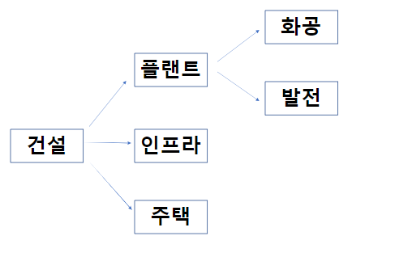

# 건설 #
## 건설 산업 분류 ##
-----------------

건설 산업은 주로 발주자로 부터 주문을 받아 생산하는 수주산업의 특성을 가지고 있고, 산업의 과정이 장기적이라 예측이 어렵고, 정부의 정책의 영향을 많이 받는다.

건설 분야는 위와 같이 3크게 플랜트/인프라/주택 이렇게 3개로 나뉜다.
### 플랜트 ###
* 화공 플랜트 : 정유/석유 화학 및 가스 플랜트를 건설하는 산업
* 발전 플랜트 : 정부, 공기업, 민간이 발주하는 석탄, 복합 화력 및 원자력, 신재생에너지 발전소를 건설하는 산업.

### 인프라 ###
    도로, 항만, 국토개발사업 등 사회간접자본(SOC)를 건설하는 산업임. -> 공공예산에 의해 집행되기 때문에 국가 정책의 영향이 큼 ex) 이명박, 바이든

### 주택 ###
    이건 뭐... 그냥 주택

## 건설 지역 관련 분류 ##
-----------------------------

### 국내 ###
* 산업 분석 : 정부 정책 분석, 주요 부동산 지표 분석
* 기업 분석 : 분양 세대 수 , 분양률, 미분양 세대수, 미착공 PF 현황 
* 참조 
    * 대한 건설 협회 : http://www.cak.or.kr/main3.do?menuId=1
    * 국토 교통부 : http://www.molit.go.kr/portal.do
### 해외 ###
* 산업 분석 : 유가, 중동지역 정세
* 기업 분석 : 신규수주 및 수주잔고, 현안 프로젝트, 미청구 공사 추이
* 유가는 해외 건설 수주액과 상관관계가 0.9에 가까울 정도(매우 높음)
* 참조
    * 유가 가격 : https://fred.stlouisfed.org/
    * 기타 에너지 관련 : http://www.kesis.net/main/main.jsp
    * 해외 건설 수주 관련 : http://www.icak.or.kr/

## 건설 산업 특수성 ##
---
### 건설 회계 ###
* 공사 진행률에 따라 매출이 인식 됨
* 예정 원가와 실제 투입 원가가 차이가 발생함

-> 위와 같은 차이가 발생하는 이유는 장기적인 산업이기 때문에 변동성이 있기 때문이다.

### 공사 진행률 ###
건설의 모든 매출액은 공사 진행률에 따라 인식이 된다.
공사 수익 = 계약 금액 * 공사진행률 (수행 공사에 대한 실제 발생 원가/ 공사 예정 원가)

### 용어 정리

1) 도급(都給) : 도읍 '도', 공급할 '급'. 일의 완성을 약속하고, 그 결과에 따라 보수를 지급하는 계약. 쉽게, 공사 프로젝트 계약이다.

2) 공동도급(共同) : 함께 '공', 한가지 '동'. 다른 시공사들과 '함께 한가지' 공사 프로젝트를 진행하는 방식이다. 프로젝트 리스크를 분담하고, 타업체들과의 상생을 위해 보통 공동도급 방식이다.

3) 도급액(都給額) : 일을 완성해주는 대가로 지급하는 보수의 총액을 의미한다. 공사 프로젝트 대금이다.

4) 원가(原價) : 공사비용을 의미한다. 공사대금(도급액)은 정해져 있으므로 원가는 낮을수록, 안잡힐수록 좋다.

5) 실행(實行) : 공사대금 대비 실제 투입된 공사비용을 의미한다. 실행률이 낮을수록, 시공사에는 수익이다. "실행이 좋다."는 말은 공사대금은 높은데 비용은 낮게 공사를 했으므로 수익성이 좋다는 뜻이다.

6) 원가배분(原價配分) : 공사진행에 투입되는 각종 비용들을 공동도급사 지분에 따라 나누는 것을 의미한다.
* 갑사(甲社) : 도급공사에서 가장 많은 지분을 책임지는 회사를 의미한다. 주관사(主管社)라고도 한다. 공사 소요비용들은 갑사에서 일괄 부담하고, 매달 원가배분 및 준공 후 정산으로 최종 정리한다.
* 을사(乙社) : 최대지분회사를 제외한 회사들을 의미한다. 비주관사(非主管社)라고도 한다.

----

1) 기성(旣成) : 이미 '기', 이룰 '성'. 이미 달성한 것. 즉, 특정기간동안 공사가 진행된 정도이다.

2) 기성율(旣成率) : 특정기간동안 공사를 진행한 비율. 공사 진행률과도 같은 의미이다.

3) 기성금(旣成金) : 기성+쇠 '금'. 특정기간동안 진행한 공사에 대한 대가로 지급하는 금액을 말한다.

* 기성청구(請求) : 청할 '청', 구할 '구'. 진행한 공사에 대한 대가를 발주처에 요구하는 것. 업계에서는 "기성을 뜬다."라고 표현하기도 한다.
* 기성수금(受金) : 받을 '수', 쇠 '금'. 진행한 공사에 대한 대가를 발주처로부터 실제로 받은 것.
* 관기성(官旣成) : 벼슬 '관'+기성. 돈을 주는 주체가 관공서이며, 그들이 지급하는 기성금을 말한다.

4) 기성고(旣成高) : 기성+높을 '고'. 진행된 공사의 총합. 현재까지 시공된 부분만큼의 공사비를 말한다.

---

1) 미청구 공사 : 미청구 공사는 공사 미수금 중에서 상대방이 확인해 주지 않은 금액이다.
2) 공사 미수금
* 기성율이 일치하지만 인식시점과 결제시점의 차이로 인해 곧 결제해 줄 금액
* 건설사가 인식한 진행률보다 도급인이 확인한 기성률이 낮은 경우 그 차액\
=> 쉽게말해서 공사 미수금은 건설사가 받아야 되는데 아직 못받는 돈
3) PF (프로젝트 파이낸스) : PF란 특정 프로젝트의 완료 혹은 향후 창출될 기대수입 등의 현금흐름을 바탕으로 자금을 대여받는 것입니다. 걍 돈빌리는 거\
4) 착공 : 공사에 착수 및 시작/ 굴토공사 같은 것을 의미\
5) 시공 : 도면에 따라 현장에서 공사를 실시하는 것.(건축공사 실시)