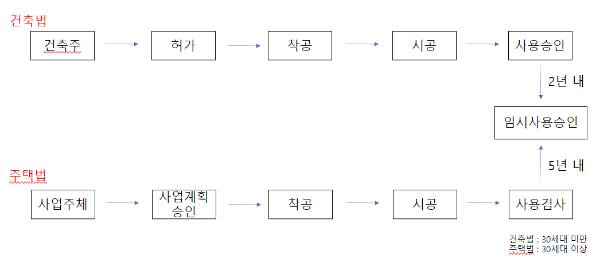
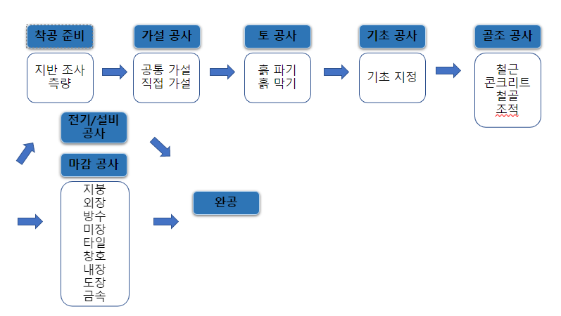

# 순서 #
## 주택의 건설 절차 ##

### 크게 보면 이렇게 나뉨 -> 주택과 건축를 구분하는 기준은 세대 수 보통 30세대지만 특별한 경우 50세대로 나뉨. 또 둘의 차이는 주택은 착공 시작 뒤 5년 내로 마쳐야되고, 건축은 2년 이내 ###

## 시공 순서 ##

### 가설 공사 ###
공사 기간 중 필요한 임시적인 시설물로 본 공사가 끝나면 해제, 철거, 정리하게 되는 제반 공사시설.
* 공통 가설 : 공사 전반에 걸쳐 공통으로 사용하는 공사용 기계, 공사관리에 필요한 시설 - 가설운반로, 가설울타리, 가설창고, 현장사무실, 임시화장실...
* 직접 가설 : 본공사에 직접적인 수행을 위한 시설 - 규준틀, 비계, 안전시설

### 토 공사 ###
토공사는 대지조성을 위하여 대지정리, 기초파기, 흙막이공사, 배수, 되메우기, 성토, 잔토처리 등을 말한다. 건축공사 중에서 공기나 공사비의 변수가 가장 많은 것이 토공사이다. 터파기에서 예측하지 못한 지하수나 암반 그리고, 강우등의 기후영향을 받기가 쉽기 때문이다. 
#### 토 공사 순서 ####
토 공사는 지반조사 - 흙막이 공사 - 터파기 - (건축공사) - 되메우기(다짐) 순이다. 흙막이란 터파기의 붕괴나 미끄럼을 방지하기 위한 공사이다.

### 기초 공사 ###
#### 바닥기초 ####
* 얇은 기초 : 기초판의 하부에 잡석, 모래 다짐등의 지정을 하는 방식
* 깊은 기초 : 기초판의 하부에 말뚝등으로 상부 하중을 전달하는 방식

### 골조 공사 / 마감 공사 ###
이건 뭐... 대충 위에 사진보면 느낌 올 듯