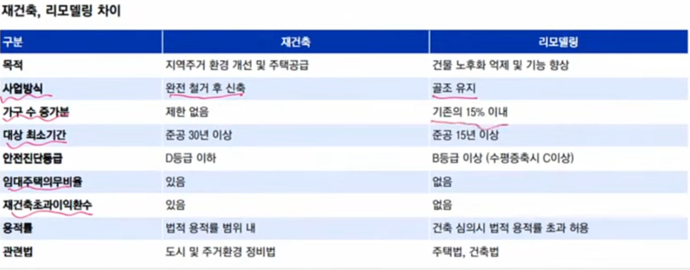

### 공급은 시간이 오래걸림 => 재건축은 규제가 있으니 리모델링이 일어날 확률이 높다.

### 물류는 증가하는데 물류 건설을 하는데 복잡성이 높아지면서 몇개의 건설사에서만 가능할 것이다.

### 건설에서 친환경 : 단열재 + 로이 유리같은 것이 많이 쓰일듯 => 로이유리: KCC글라스

### 물류쪽 : sgc이테크건설

### 한미글로벌 : NEOM관련