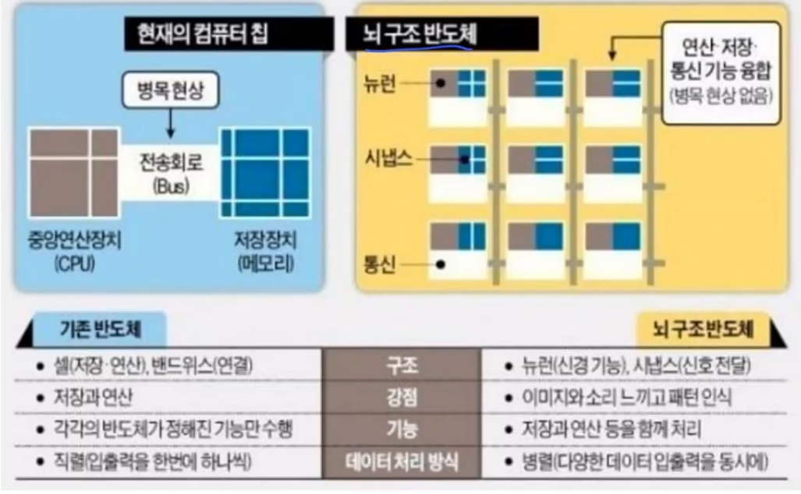

# 반도체 #
## 구조 ##
### 하버드 구조 ###

### 중요도 ###
#### 위의 구조를 보면 알겠지만, DRAM은 속도가 중요하고 NAND는 저장을 어떻게 하면 중요할지, CPU는 로직(비메모리) #### 
### 미래의 구조 ###

#### 아직은 안되지만 병렬적으로 처리가 가능하게 하려면 위와 같은 식으로 가야한다.(이건 너무 먼 미래) ####
 

----------------

 

## 메모리 비메모리 ##

## 메모리 시장 ## 

## 반도체 생태계 ##
 

#### 종합 반도체 기업 = 삼성 ####
#### 우리나라는 대부분 팹리스 => 생산은 파운드리(삼성,TSMC,DB하이텍) ####
#### 디자인 하우스 - (설계랑 생산)사이에서 되는지 안되는지 체크해주는 곳 ####
#### OSAT(패키징 및 테스트) 하는 곳 ####

## 반도체 핵심 ##
### 누가 빠른 반도체를 만드는지 or 면적당 밀도를 높이느냐 싸움임 (작게 만들어야 됨) ###
### 크기를 줄이려면 누설전류가 많이 생김(저항이 작아지기 떄문에) => 이러다 보니 누설 전류를 막기위해 하는 것이 미세화 공정임(가장 쉽게하는게 게이트 하나 더 추가) ###

## 미세화 공정 두가지 방안 ##
### FET 구조 변화를 통한 채널 길이 감소 문제 해결 ###
 * 누설 전류를 막기 위해 채널의 길이를 길게 해줄 필요가 있으나, 채널의 길이를 길게 할 경우 소자의 크기가 도로 커지게 됨
 * 채널의 길이는 줄여야 함으로 동일한 길이 내에서 소자의 효율을 높이는 방안을 고민 -> 채널과 게이트의 접합면을 확대
  * 실리콘 기판을 상어 지느러미(Fin) 모양으로 튀어나오도록 하고, 게이트가 이를 감싸도록 하여 접합면 확대 -> FinFET구조

### Gate와 Channel 사이의  절연층 소재(유전체) 변경을 통한 게이트 크기 축소 문제 해결 ###
 * 게이트와 기판 사이에는 Insulator가 존재하여 전류를 더 효율적으로 전달하거나 차단할 수 있도록 도움
 * 기존에는 SiO2 Insulator를 이용했으나, 소자 크기가 작아지면서 더 효율이 좋은 소재가 필요하게 됨 -> High-K의 등장
 * High-K는 유전율이 높은 물질을 의미하며, 쉽게 말해 배선 간 전류 차단 능력이 뛰어나고 게이트 절연 특성이 좋음

 ### 미세화 공정 구조 ###
 
 그림을 보면 알 수 있듯 게이트와 닿는 표면적을 넓혀서 게이트가 컨트롤하기 쉽게 유지함.

 ## DDR5 ##
 ### ECC(Error Conrrection Code) 구현 했음 => 컴퓨터 Hamming Code같은거 들어갔다고 생각하면 될듯? => 메모리 신뢰성은 좋아짐 => 데이터를 넣을 공간이 줄어들긴 함 ###
 ### 이해 안되는 부분(TODO) => 속도가 중요한 DRAM에서 굳이 하는 ECC를 사용하는 이유가 뭔지 모르겠음 ###

# 반도체 제조 공정 #

## 제조 공정 1단계 ##
 ### 반도체 웨이퍼는 폴리실리콘으로 만듬 -> 이건 메탈 실리콘으로 -> 이건 규소로 만듦 ###
### 폴리 실리콘이 아주 순도가 높은 것을 반도체에서 사용함(twelve nine정도는 되야함) 전기로를 가지고 있는 폴리실리콘 회사만 가능 => 조금 떨어지면 태양광 웨이퍼로 사용 ###
### 폴리 실리콘을 녹여서 잉곳을 만들고 잉곳을 키워서 얇게 슬라이스 치면 웨이퍼가 됨 => 그리고 그 웨이퍼 표면을 연마하면 이게 제조공정 1단계임 ###

## 제조 공정 2단계 ##
### 웨이퍼에 산화막을 씌우는 과정 (씌우는 것을 반도체에선 증착이라고 함) ###
### 하는 이유 : 불순물 보호막, 전류 누설 방지 절연막, 이온 주입 공정시 확산, 식각 방지막 ###
### 화학적 증착 방식을 자주 사용 ###

## 제조 공정 3단계 ##
### 집적회로 를 넣어야 함 ### 

## 제조 공정 4단계 ##
### 포토 공정 ###
### 반도체는 너무 작으니 4,5배 되는 마스크를 만들고 렌즈를 통과해서 빛을 모은뒤 쏴줌(빛의 파장이 작을수록 쓰기가 쉽기 때문에 빛의 파장이 매우 작아야됨 => 여기서 나오는게 EUV임(ASML)) => 빛을 써야되니까 감광액을 발라야 함 => PR(photo register 동진쎼미캠) ###
### 마스크를 보호나는게 펠리클 ###
### !!! EUV로 가는순간 많은게 바뀌어야 함(빨리 사라지고, 반사도 안되고, 투과도 안됨) => 감광액이 바뀌어야함(PR이 바뀌어야됨) => 마스크도 바뀌어야 됨(펠리클도 바뀌어야됨) ###
### 4단계 공정에 속해있는 회사(EUV로 바뀐다면 이득을 볼) ###

## 제조 공정 5단계 ##
### 식각 단계 ###

### 예전에는 크기가 좀더 크다보니 조금씩 산화막이 감광액과 다르게 좀더 벗겨져도 상관이 없어서 액체를 주로 사용했으나, 크기가 작아지면서 미세하게 잘 없에야함 가스를 사용함(건식) ###

## 제조 공정 6단계 ##
### 증착&이온주입 ###
### 이온주입은 도체를 반도체로 만드는 과정이라고 생각하면 됨 ###

### 이 다음이 ALD(원자적 증기증착) 이쪽으로 가고있음 ###

## 제조 공정 7단계 ##
### 금속 배선 공정 ###

#### 알루미늄, 티타늄, 텅세튼 ####

## 제조 공정 8단계 ##
### 테스트 ###

자동차를 만드는 것은 Hot/COld(실내에서만 사용하는게 아님) => 영하 20도, 이런 곳에서도 실험을 해야되서 어려움

### 패키징 ###
패키징해서 절단하는 것을 소잉이라고 함
예전엔 와이어 방식 => 요즘늠 벌프랑, 칩을 통해서 패키징함(데이터가 많아서)

### 적층 ###
적층을 할때 와이어로 잇는 기술도 있지만, 홈을 뚫어서 하면 구조도 좋아지고 전력도 적게소모됨 => (TSV 공정) => 구멍을 잘뚫고 쓰러지지 않게하고 연결시키는 과정