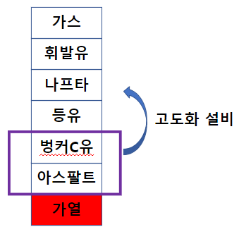
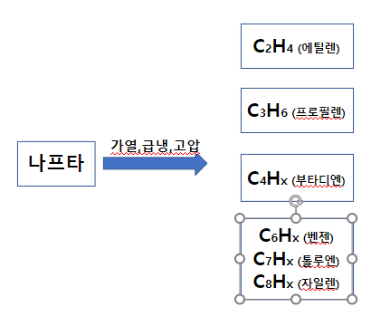

## 밀러의 실험 ##
#### 암모니아(NH3) + 이산화탄소(CO2) + 메탄(CH4)를 가열을 시키면 단백질이 형성이 된다. => 탄소라는 애는 팔이 4개라 결합을 하는 경우의 수가 많음(같은 화학식에서 다른 성질이 많이 나옴) ####
### 단백질에서 DNA가 나오는데 자아 복제기능이 있음. 환경이 맞기 떄문에 군집이 일어남 => 이러한 식물의 군집, 동물의 군집의 사체들이 땅속에 들어가서 탄소와 수소가 만나서 탄화수소가 됨 => 이것이 석유 ### 
#### 석유를 가열하다보면 고체 상태였던 탄소들이 기체화가 되면서 지구온난화가 생김 ####

## 석유 ##

### 석유를 가열하면 위와같이 나열되는데 위에서 부터 가벼운 순서(탄소가 적음) 대로 나온다. 여기서 중요한 것은 나프타를 제외한 나머지는 다 태우거나 폭발시키면서 에너지를 사용하는데 씀. 나프타는 화학공정으로 사용함. ###

## 나프타 ##
### 나프타는 C H로 이루워져 있는데 이것을 가열, 급냉 고압을 통해 화합물을 걸러내서 아래와 같이 나옴 이과정을 NCC라고함 ###

## 가스 ##
### 사우디에서 나오는 중질유와는 다르게 미국에서 가져오는 경질유에서는 가스가 많이 나옴(이름 그대로 가벼워서) LNG(CH4) => 70%정도 나옴, LPG(C3H8) => 10% 정도 나옴 ###
### 정유에서 나온 가스(C3H8)에서 H두개만 날리면 프로필렌(C3H6)이됨  => 위와같이 가스가 많이 나오니까 가스에서 프로필렌을 추출하기위해 PDH(탈수소) => 이과정을 ECC라고 하는데 효성화학에서 잘해서 나오는 수소를 활용하기 위하여 세계에서 제일 큰 수소 공장을 지었음 가스는 가벼워서 에틸렌과 프로필렌을 추출할 수 있음 근데 위에서 볼 수 있듯 경질유에서는 가스가 많이 나옴 ###

## 스프레드 ##
### 에틸렌은 => PE => PVC 이런 식으로 만드는데 이사이의 스프레드를 통해 돈을 범 사이의 가격차이가 클수록 돈을 많이 번다 ###

## 에틸렌 ##
### 에틸렌이 산업의 꽃이라고 불림(쓰임이 많음) ###
### 중질유에서는 잘 안나오는데 NCC의 과정처럼 가열,급냉,고압 과정에서 나프타 + LPG를 하면 LPG자체가 가볍기 때문에 에틸렌 프로필렌이 더 잘나옴 ###

## LPG ##
#### 우리나라는 섬나라임 => 북한 때문에 ####
#### 그래서 LNG를 많이 씀 => LNG를 제일 많이 쓰는 나라 => 1.일본 2.한국 ####
#### 다른데는 PNG(파이프로 가스를 끌어다 쓰는것)를 많이씀 ####
#### 우리나라가 LNG, LPG에 강함 ####
#### LPG는 수송 / 석유화학에서 가장 많이 씀 => 수송은 어쩔수 없이 줄어들 수 밖에 없음, 석유화학은 위에서 본 것처럼 많이 늘어날 수 있음 => 근데 여기서 margin은 어디가 좋냐, 보면 수송쪽이 훨씬 좋음. 석유화학이 증가 하다보면 maring은 개선이 될것이고(수요가 많아지면), 그러다 보면 매출은 이미 증가한 상황에서 많은 돈을 벌 가능성이 있음 ####

## 석유화학의 특수성 ##
#### 비탄력적임 : 정유 때문에 원하는 것만 만들 수 없음. 하나가 필요하면 어쩔수 없이 다 만들어야됨. 벤젠만 필요하다고 벤젠만 뽑을 수 없음 #### 