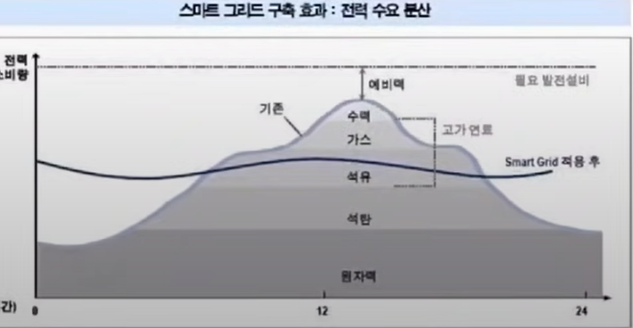
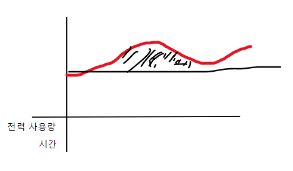
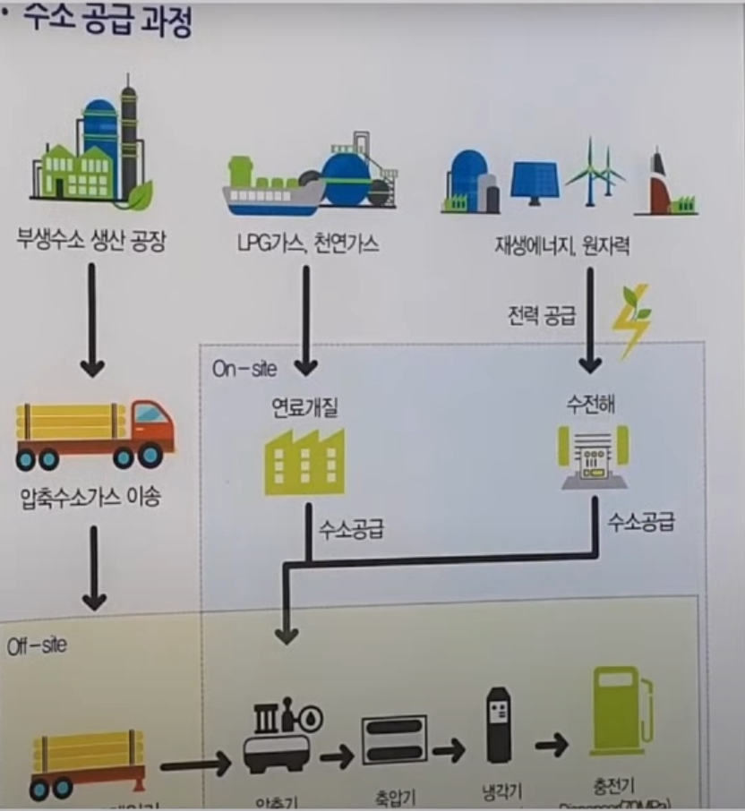

## 환경 ##
요즘 기후 관련, 뉴스가 많이 올라오고 있다. 환경의 문제가 대두 되면서, EU나 미국에서 관련 정책이 나오고 있음. => 정책들이 중국을 견제하기 위해서라는 말도 있지만, 그 말을 중국을 추종하는 학자일 수도 있고, 그것은 아무도 모른다.(지구를 가지고 테스트를 할 수는 없기 때문에) => 여기서 가장 중요한 것은 돈이 환경 관련 분야로 흘러가고 있다는 것이고, 신산업이라 업사이드가 매우 클 것이라고 생각한다.

### 테슬라 ###
테슬라를 예로 들어보자 -> 배터리가 탄소를 줄여준다는 얘기는 사용을 할 때를 기준했을 때의 얘기이다. 사실 배터리를 만들 때 만들어지는 탄소 배출량 까지 더한다면, 탄소 배출량이 줄어들지 않는다는 것을 볼 수 있다(물론 매우 장기적으로 사용을 한다면 배터리가 이득 -> 근데 너무 오래걸려서 비슷함). 중요한 것은 정책이 그렇게 가고있다는 것이고 그렇기에 돈이 쏠린다는 것이다. 신사업이 많이 나올 수 있고, 투자자로서는 거기에 집중을 해야된다고 생각을 한다.

### 최근 환경 관련 ###
기후가 매우 올라가고 있고 역대급 폭염이라는 말이 뉴스에서 자주 나오고있다. 그로 인해 해수면이 상승하는 것도 문제이고 가뭄도 문제고, 산불도 문제고... 환경 관련 많은 문제가 생기고 있다. 이를 이유로 정부에서 많은 정책을 내기 시작했는데 탄소를 줄이기 위한 노력을 많이하고 있다. 

## 지구의 온도가 올라가면서 나오는 현상 ##
#### 해수면 상승/가뭄/토네이도/산불/홍수 ####

## 그로 인한 문제 ##
### 해수면 상승 ###
* 도시가 물에 잠김
    * 해상도시(PHC 파일이 많이 들거임) -> 동양파일, 삼일씨엔에스, kcc글라스
    * 하수처리 -> 물이 위에서 아래로 흘러가야 되는데, 주변 해수면 상승으로 해수면이 하수처리 하는 곳 보다 위에 있는 경우 펌프를 사용해서 하수를 처리해야됨  
* 해수면 주변 도시 아파트 붕괴
### 가뭄 ###
* 곡물 가격 상승 할 수 있음 -> 스마트 팜
* 유람선 들이 갇혀 있음
### 홍수 ###
*  비가 올 때만 옴, 올 때 너무 많이옴 -> 물을 다 저장할 수 없음 -> 하수를 많이 끌어다 써야 되고 결국 하수 처리를 많이 해야됨 -> 물이 공급되는 과정을 공부해 보자

### 빙하가 녹음 ###
* 시베리아 빙하 밑에 있던 CH4가 계속 나오고 있음
* 수억년 전에 빙하 밑에 잠겨 있던 탄저균들이 나올 수 있다.

## 해결 방법 ##
* 가능한 모든 과정을 전기화 해야 됨
* 이미 탈탄소화한 전력망으로 부터 전기를 얻어야 됨
* 배출되는 이산화탄소를 흡수하기 위해 탄소 포집 기술을 활용해야 됨 -> CCUS
* 더 효율적으로 자재를 사용해야 됨

## 이산화탄소 제일 많이 나오는 곳 ##
### 1. 전력생산, 2. 철강, 3. 정유 화학, 4. 시멘트 ###
### 이 산업들이 해야할 일 -> 석탄, LNG를 줄이던가/ 탄소 포집을 하던가 ###

## 수소 ##
#### 현재는 gray 수소임 => CH4를 통해 전력을 생산하기 때문에 => CH4를 통해 전력을 생산한 것을 CCUS로 탄소를 줄인다면 블루 수소가 됨 ####
#### 신재생 에너지의 전력으로 물분해/ 수전해를 하는것이 그린수소임 ####

### 태양 전지, 풍력, 수소 ###
#### 태양 전지는 우리나라의 평균 일조량이 너무 낮기 때문에 적합한지 잘모르겠음 => 호주나 사막에서 태양광을 해서 => 수전해를 해서 => 수소를 가져오는 것이 더 효율적일 수 있다. ####

### 현재 전력을 맞추는 과정 ###
날씨, 계절, 밤낮에 따라 전력을 사용하는 양이 다다른데 현재 전력을 맞추는 과정은 다음과 같다\

## 기저 발전 ##
#### 원자력 발전소가 제일 먼저 실행(가동시간이 제일 오래걸리기 때문에 : 보름씩 걸림) -> 석탄(3일 ~ 일주일 걸림) -> 석유(요즘잘 안씀) 위의 3개처럼 가동 시간이 오래걸려 즉각 대응을 하지 못하는 것들을 기저발전이라고 한다. #### 

## 첨두 발전 ##
#### 즉각적인 대응이 가능하여 시시각각 변하는 전력량을 cover해주는 것들 : 가스, 수력 ####

## 간헐적 발전 ##
#### 풍력, 태양광 -> 일정 조건이 맞아야 사용할 수 있음(바람이 불어야 되고 태양이 떠야 됨) => 전력은 왔다 갔다함 => 남는 것을 저장해야 첨두 발전을 대체할 수 있음 => 저장 방법 : ESS(자연으로 방전됨), 수소 => ESS는 자연으로 방전될 경우 때문에 수소로 가야될 확률이 높다 ####

## 탄소 배출권 ##
#### 새로 개발하는 것에 대해서는 탄소 배출권을 안줌 -> 기존에 있는 것에서 배출량을 줄여야만 판매할 수 있음 ####

## REC ##
#### 신재생 인증 license ####
#### 500MW의 발전설비를 보유한 발전사업이 매년 사야됨 1MW당 가중치 * 1REC만큼 rps제도로 REC를 사는거임 ####
#### rps는 매년 올리고있음 => 즉 REC를 계속 사야함 500MW이상의 발전설비를 보유한 곳에서 ####

## 목재 ##
#### 목재는 탄소 배출 0임 => 이유 : 나무가 자라면서 먹는 탄소양이 태우면서 나오는 탄소양 보다 더 적기 떄문에 ####

## SMP ##

#### 그림은 이상 하지만 대충 보면 시간에 따라 전력 사용량이 다 다르다는 것을 알 수 있고, 색칠이 안된 곳을 원자력, 석탄과 같은 기저 발전을 통해 커버를 한다는 것을 알 수 있다. #####
#### 또 색칠 된 곳은 가스나, 수력을 통해 커버를 하는데 LNG의 효율에 따라서 사용을 하게 되는데 전력 사용이 적을 때는 효율이 좋은 LNG만 사용하고 많이 필요할 떄는 효율이 안좋은 것도 같이 사용한다. 그렇게 가격이 정해지는 것을 SMP라고 보면된다. ####
#### 많이 사용해서 LNG가 많이 필요할 수록 SMP가격이 오름 => SMP는 두바이유 5~6개월 후행(운송의 문제, 한국의 재고 때문에) ####
#### 미국 LNG 직도입 가격이 올랐음 CH4가격이 폭등했기 때문에 SMP가격이 상승할 수 밖에없음 ####
#### 여기서 생기는 문제 -> LNG를 대체할 간헐적 발전인 신재생 에너지가 쓰여야됨 -> 저장을 해야 됨(굉장히 전력을 세밀하게 컨트롤 해야됨) -> ESS나 수소로 바꿔서 저장 ####
#### 전기 -> 수소 -> 전기 => 저 사이의 lose가 많이 일어나기 때문에 저장을 매우 많이 해야됨 ####
 
## 수소가 전기를 만드는 과정 ##
### H + O => e + H2O => 전기 나옴 ###
* 수소를 움직이는 방법 (PEMEC)
    * 수소를 원자단위로 만들어야됨 => H+와 O-가 만나서 H2O가 되는데 H를 굉장히 촘촘한 막(폴리 => 고어텍이 잘만듦)에 백금을 넣어야됨 => 자동차 같은건 이걸로 
* 산소를 움직이는 방법 (SOFC)
    * 산소에 열음 엄청가하고(800 도) 얇은 세라믹을 통과시킴 => 가격이 싸고 횽휼이 높음 => 발전을 이걸로하고
#### H2O + 전기 => H O (수전해) ####

## 수소 공급 과정 ##

## 부생수소 ##
#### 탄화수소에서 부산물로 나오는 수소(그렇게 많지 않음, 수소를 만드는 목적이 아닌 하다보니 나오는것) ####
#### LPG : C3H8, 천연가스 : CH4 => 여기서 탄소제거 ####
#### 신재생 에너지, 원자력 => 전력 나오면 수전해를 통해서 수소를 뽑음 ####

## 수소 분류 ##
* 그린수소 : 재생에너지 전력으로 수전해 하여 생산한 수소(온실가스 배출이 없음)
* 그레이 수소 : 탄화 수소에서 뽑아낸 수소 => 결국 탄소가 나옴 => CCUS를 통한 탄소 포집
* 블루 수소 : 그레이 수소를 포집한게(CCUS) 블루수소

## 수소 저장 방법 ##
* 기체수소 압축
* 액화수소
* 액상수소
* 암모니아
### 현재는 액화수소랑 암모니아 많이 사용 ###

----------------------

### 전소 ###
#### 석탄을 제외한 우드팰릿으로만 불을 떼는 것 ####

### 혼소 ###
#### 석탄 + 우드팰릿으로 불을 떼는 것 ####
